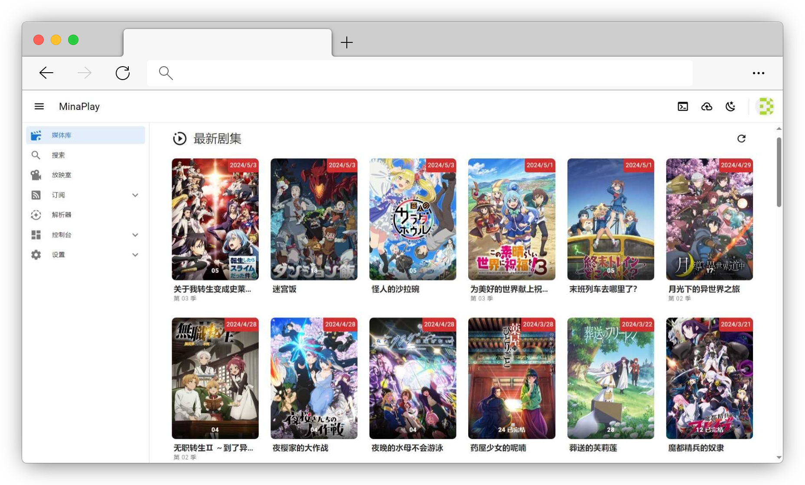

<div align="center">


<br/>


----

MinaPlay 是一个视频聚合 RSS 订阅的自动下载管理工具



</div>

## 项目说明

MinaPlay 是一个用于追番 / 追剧的个人媒体库。MinaPlay 根据用户创建的 RSS 订阅源、订阅规则自动下载媒体文件并生成描述信息。

### 主要特性

- **追番 / 追剧服务**，个性化配置 RSS 订阅源、下载规则，打造独一无二属于自己的追番 / 追剧管家。
- **同步观影放映室**，支持聊天消息和多人语音，叫上好朋友一起观影共享欢乐。
- **通知服务** 高度可拓展、可自定义模板，新内容的更新时间不再错过。
- **插件系统** 简单易用，像使用命令行一样调用各种插件提供的服务。

### 项目文档

[文档传送门](https://nepsyn.github.io/minaplay/)

## 快速开始

### Docker Compose 部署

推荐使用 [Docker Compose](https://docs.docker.com/compose/) 快速部署 MinaPlay。

将以下代码保存到文件 `docker-compose.yml` 中，或直接使用预设的 [docker-compose.yml](docker-compose.yml) 文件。

```yaml
version: '3.8'

services:
  minaplay-mysql:
    image: "mysql:8"
    container_name: minaplay-mysql
    networks:
      - minaplay-network
    environment:
      - TZ=Asia/Shanghai
      - MYSQL_ALLOW_EMPTY_PASSWORD=yes
      - MYSQL_DATABASE=minaplay
    restart: always
    volumes:
      - mysql-data:/var/lib/mysql

  minaplay-redis:
    image: "redis:latest"
    container_name: minaplay-redis
    networks:
      - minaplay-network
    restart: always

  minaplay:
    image: "nepsyn/minaplay:latest"
    container_name: minaplay
    networks:
      - minaplay-network
    volumes:
      - ./data:/app/data
    environment:
      - DB_HOST=minaplay-mysql
      - REDIS_HOST=minaplay-redis
      - MS_ANNOUNCED_ADDRESS=127.0.0.1  # 在需要放映室语音通话服务的情况下改为宿主机外部访问地址
    ports:
      - "3000:3000"
      - "12000-12999:12000-12999"
    depends_on:
      - minaplay-mysql
      - minaplay-redis
    restart: unless-stopped

volumes:
  mysql-data:

networks:
  minaplay-network:
```

使用命令运行 MinaPlay 服务。

```shell
docker compose up -d
```

### 开始使用

首次启动时，系统将会打印默认超级管理员 minaplay 用户及其密码，可通过命令 `docker logs minaplay` 查看。

```
[Nest] 14  - 02/28/2024, 3:25:37 PM     LOG [UserManagerPlugin] Default root user created, username: minaplay, password: xxxxxxx
```

启动成功后，在浏览器中访问 `http://127.0.0.1:3000` 即可跳转到 MinaPlay 的登录页面。

## 构建过程

请移步不同子项目的说明文档：

- [MinaPlay server](packages/server/README.md) - MinaPlay 服务器端，用于提供 MinaPlay 的各项服务。
- [MinaPlay web](packages/web/README.md) - MinaPlay 网页端，用于提供 MinaPlay 用户界面。
- [MinaPlay docs](packages/docs/README.md) - MinaPlay 的用户说明文档。

## 相关群组

欢迎加入 MinaPlay 的相关讨论群组，你可以在这里提出建议、参与开发、聊天摸鱼~

- [QQ 讨论群](https://qm.qq.com/q/t0QzNLAldm)

## License

[AGPL-3.0 License](LICENSE)
